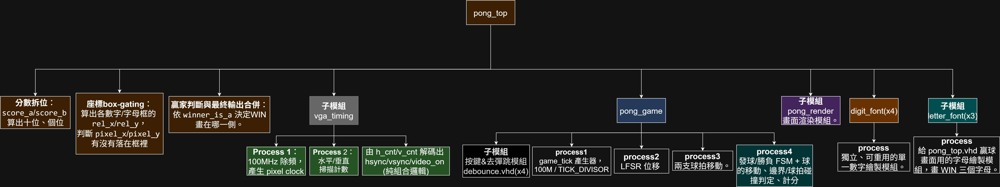
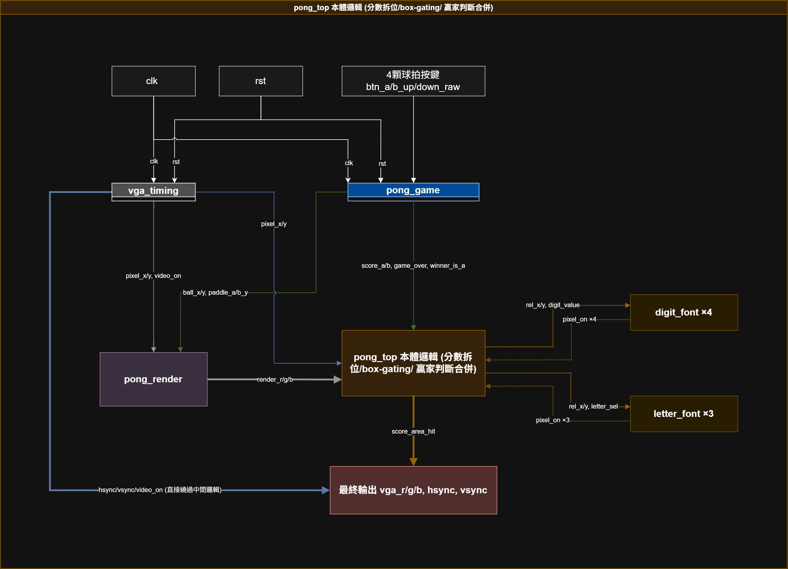
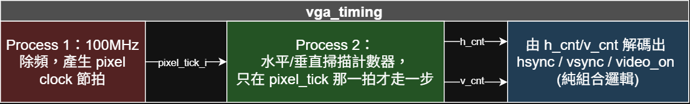
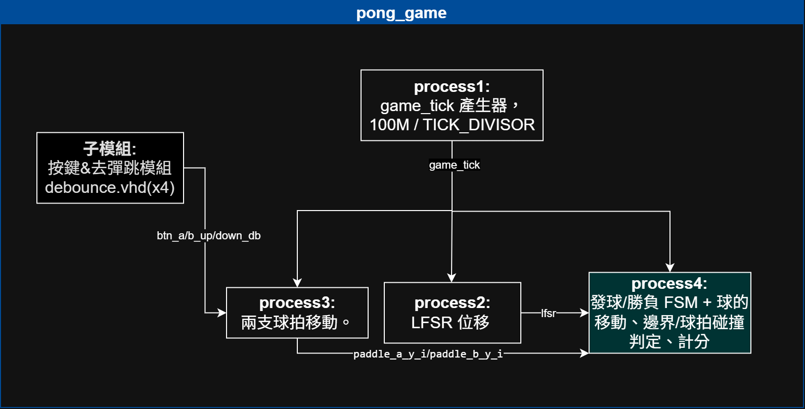
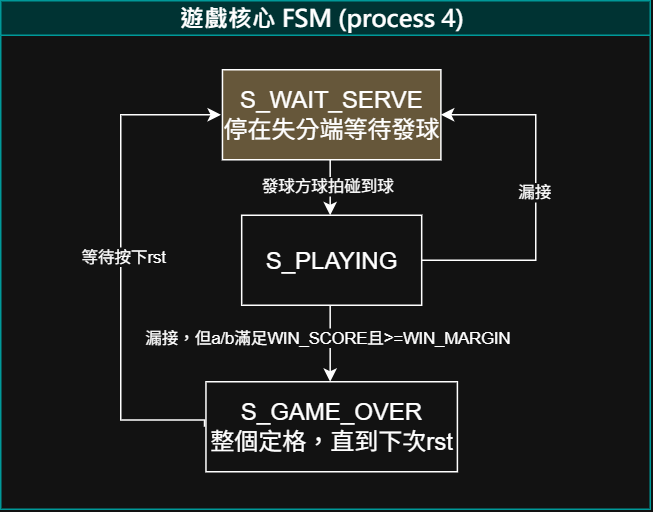
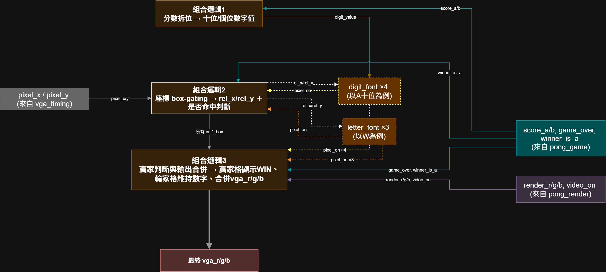
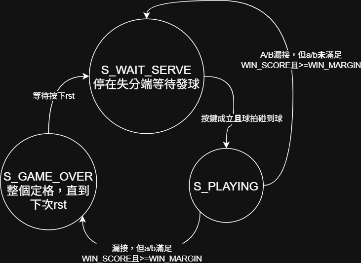
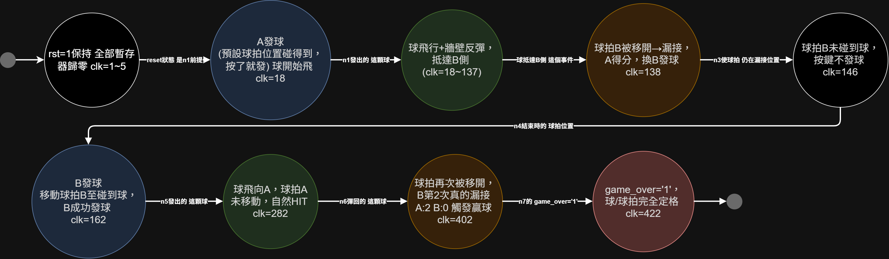

# Project 8：VGA Pong 雙人對戰遊戲 (Atari-Style VGA Pong)

## 項目簡介 (Project Description)

本項目為 FPGA 數位電路設計之 **Project 8：整合 Project 7 的 VGA 顯示技術與 Project 5/6 的雙人對戰精神，實作一套完整的 Atari Pong 遊戲**。

雙方各自操作球拍即時對戰，球體飛行、碰牆反彈、球拍碰撞判定與計分全部即時運算，並直接以 VGA 訊號輸出畫面，含分數數字與贏家 WIN 字樣顯示。跟 Project 7 不同，這裡完全不牽涉 block RAM 讀取，核心難題不是延遲對齊，而是要把「球/球拍狀態運算」「畫面渲染」「分數與文字疊加」三件事清楚分工成獨立模組，讓 `pong_top` 這個頂層只做接線跟共用幾何 generic 的分派，不摻雜任何遊戲規則本身的判斷。

---

## 一、系統設計與硬體架構

### 1. 系統架構與模組階層 (Module Breakdown)

頂層 `pong_top` 底下分成三個結構化子模組——沿用 Project 7、完全沒有修改的 `vga_timing`（時序產生），以及新增的 `pong_game`（遊戲核心：發球/勝負 FSM、球與雙球拍運算、LFSR、計分）與 `pong_render`（純渲染，依座標畫出球與球拍）——外加兩組可重用的字型模組 `digit_font` ×4（A/B 分數各兩位數）與 `letter_font` ×3（贏家格改顯示的 WIN 三個字母）。球、球拍、分數全部是純暫存器，`pong_render` 可以直接用組合邏輯拿這些座標跟目前掃描到的 `pixel_x/pixel_y` 比較，不需要 Project 7 那種額外 1 拍延遲對齊。`pong_top` 自己則保留三段內嵌組合邏輯：分數拆位、座標 box-gating、贏家判斷與最終輸出合併，這三段邏輯要同時知道 `score_a/b`、`pixel_x/y`、`winner_is_a` 才能決定畫面，沒有拆成獨立檔案的必要。另外 `pong_game` 有一個 `game_tick_dbg` 輸出純供模擬觀察，`pong_top` 實體化時把它跟 `vga_timing` 的 `pixel_tick` 都留空（`=> open`），避免重蹈 Project 7 開發初期除錯用 port 沒接腳位、導致 bitgen 因 unconstrained port 失敗的覆轍。

### 2. 系統電路圖與硬體方塊圖 (Hardware Block Diagram)

主圖標出 `clk`/`rst`/4 顆球拍按鍵輸入，`vga_timing` 送出的 `pixel_x/y`、`video_on`，`pong_game` 送出的 `ball_x/y`、`paddle_a/b_y`、`score_a/b`、`game_over`、`winner_is_a`，`pong_render` 算出的 `render_r/g/b`，最後在 `pong_top` 本體邏輯內用 `score_area_hit`（目前這個 pixel 是否落在計分板或 WIN 字樣範圍內）決定輸出全白（`"1111"`）還是 `render_r/g/b`；`hsync`/`vsync` 由 `vga_timing` 直接繞過中間邏輯輸出，不受計分/贏家畫面影響。另外四張分別放大 `vga_timing` 內部三個 process、`pong_game` 內部四個 process、process4（發球/勝負 FSM）本身，以及 `pong_top` 本體（分數拆位／box-gating／贏家判斷）內嵌組合邏輯的細節。

**vga_timing 內部**

**pong_game 內部**

**process4：發球/勝負 FSM**

**pong_top 本體邏輯細節**

---

## 二、有限狀態機設計 (Finite State Machine, FSM)

FSM 收在 `pong_game.vhd` 的 process4 裡，三個狀態：`S_WAIT_SERVE`（停在失分端等待發球）、`S_PLAYING`（對戰進行中）、`S_GAME_OVER`（整個定格，直到下次 rst）。跟 Project 5/6 只要「按任一鍵就發球」不同，這裡要求發球方球拍已經與球在垂直方向重疊、且按鍵成立，兩個條件同時滿足才會從 `S_WAIT_SERVE` 轉進 `S_PLAYING`；漏接後依分數判斷回到 `S_WAIT_SERVE`（比賽未結束）或 `S_GAME_OVER`（分數達 `WIN_SCORE` 且領先達 `WIN_MARGIN`，硬體預設 11 分、淨勝 2 分）。

---

## 三、時序規格藍圖 (Timing Specifications)

跟 Project 7 一樣改用 UML 循序圖表示，但因為 `pong_game` 用自己的 `game_tick`（100MHz 除頻，硬體預設 `TICK_DIVISOR=1,000,000`，約 100Hz）驅動遊戲邏輯，跟 `vga_timing` 的像素時脈完全脫鉤，圖上把 Process1（game_tick 產生器）、Process3（球拍移動）、Process4（發球/勝負 FSM＋球）各自的生命線並排，展示同一個 `game_tick` edge 到達時三者各自更新的內容跟先後關係，並標出按鍵經 debounce 兩級同步＋穩定計數後才生效的完整過程。

---

## 四、模擬行為流程 (Simulation Flow, Activity-on-Vertex)

`tb_pong_game_chain.vhd` 採跟 Project 7 同一種「單一 UUT、單一 reset、全程連續」的驗證方式，每個檢查點的起始狀態都是前一個檢查點造成的直接結果，構成一條真正的依賴鏈，不是各自獨立的情境。跟 Project 6 不同的是：這裡 LFSR 只影響球拍擊球瞬間要不要翻轉垂直方向，不影響球的水平速度（`BALL_SPEED` 固定），水平方向抵達邊界的時機完全 deterministic，因此 AoV 上每個節點仍然可以標出精確的 clk 數，不需要像 Project 6 那樣改標「約」。測試平台用縮小參數（`SCREEN_W_TB=40`、`SCREEN_H_TB=20`、`PADDLE_H_TB=6`、`PADDLE_SPEED_TB=3`、`BALL_SPEED_TB=1`、`TICK_DIVISOR_TB=4`、`DEBOUNCE_LIM_TB=3`、`WIN_SCORE=2`、`WIN_MARGIN=2`）加速模擬。

### 測試平台核心激勵步驟
1. **Reset 保持**（第 1~5 clk）：`rst=1`，所有暫存器歸零；球拍垂直置中，球停在 A 側等待位置（`ball_x=A_WAIT_X=4`、`ball_y=SCREEN_H_TB/2=10`）。
2. **A 發球**（第 18 clk）：預設球拍位置本來就與球重疊，`btn_a_up`／`btn_a_down` 任一按下即成立 → `state<=S_PLAYING`，球開始飛行。
3. **球飛行＋牆壁反彈，B 球拍同時被移開**（第 18~137 clk）：球持續飛行、碰上下邊界即反彈；同一時間 B 球拍被移動到底端（clamp 到 `SCREEN_H_TB-PADDLE_H_TB=14`）。
4. **B 真的漏接，A 得分、換 B 發球**（第 138 clk）：球抵達 B 側，B 球拍不在球的垂直範圍內，判定漏接；`score_a<=1`，`serving_a<='0'`，球歸位到 B 側等待（`ball_x=B_WAIT_X=34`）。
5. **漏接方球拍未歸位，按鍵不發球**（第 146 clk）：B 球拍仍停在 14，跟球的垂直位置不重疊，按鍵不成立發球條件，維持 `S_WAIT_SERVE`。
6. **B 移動球拍後成功發球**（第 162 clk）：B 球拍移入碰球範圍，`state<=S_PLAYING`，球開始朝 A 飛行。
7. **球飛向 A，自然 HIT**（第 282 clk）：A 球拍全程未離開初始位置，自然接到球，比分不變（1:0）。
8. **B 球拍再次被移開，第 2 次真的漏接，觸發贏球**（第 402 clk）：`score_a<=2`，達到 `WIN_SCORE=2` 且領先 `WIN_MARGIN=2`，`game_over<='1'`、`winner_is_a<='1'`。
9. **贏球後定格**（第 422 clk）：持續按住按鍵，球與雙方球拍座標皆不再變化，直到下次 `rst`。

---

## 五、發球與計分顯示設計細節

球的發球位置固定在發球方球拍側（`ball_x = PADDLE_A_X+PADDLE_W` 或 `PADDLE_B_X-BALL_SIZE`）、垂直置中（`ball_y = SCREEN_H/2`），不是螢幕正中央；發球方要先把球拍移到跟球重疊的高度、再按鍵才會發球——`S_WAIT_SERVE` 狀態每個 `game_tick` 都重新檢查一次「按鍵成立 且 球拍與球垂直重疊」，單純按鍵不會發球。這裡讀的是 debounce 去彈跳後的穩定電位（`btn_level`，程式裡命名為 `btn_a_up_db` 等），跟驅動球拍移動用的是同一組訊號，沒有另外設計專門的發球鍵。reset 後球拍預設垂直置中（`(SCREEN_H-PADDLE_H)/2`），恰好跟球的預設 Y 座標重疊，第一次發球因此只需按鍵；之後漏接方球拍多半已經移到別的位置，需要真的移動過去才能重新發球，且漏接方於下一球擔任發球方。

計分與贏家顯示是 `pong_top` 本體三段組合邏輯的核心：分數拆位把 `score_a/score_b` 各自拆成十位、個位（`NUMERIC_STD` 沒有定義 unsigned 的 `/`／`mod`，改用 `to_integer` 轉整數運算，並多做一次 `mod 10` 防呆，避免超出 `digit_value` 的 4-bit 表示範圍造成環繞）；4 個數字框固定畫在畫面上方置中（`SCORE_Y=20`，A 十位/個位在 `A_TENS_X=230`／`A_ONES_X=265`，B 十位/個位在 `B_TENS_X=345`／`B_ONES_X=380`，每格 `DIGIT_W×DIGIT_H=30×50`，整組橫向置中對齊 `SCREEN_W=640`）。贏球後（`game_over='1'`），贏家那兩格改畫 WIN 三個字母（`letter_font`，縮小成 `LETTER_W×LETTER_H=20×50` 對齊數字框高度），畫在贏家分數十位起始的絕對座標（`winner_is_a` 決定用 `A_TENS_X` 或 `B_TENS_X`），輸家那兩格則繼續顯示原本的數字；不論分數或 WIN 字樣，命中的 pixel 一律輸出純白 `"1111"`，配色比照經典 Atari Pong 黑底白圖。

球拍上下邊界改用明確 clamp 處理（`paddle_a_y_i >= PADDLE_SPEED` 才正常相減，否則直接夾到 `0`；上邊界同理夾到 `SCREEN_H-PADDLE_H`），不只靠減法前的 guard 擋住，因此 `PADDLE_SPEED` 不需要整除邊界距離，球拍仍能精確停在 `0` 或 `SCREEN_H-PADDLE_H`。球拍擊球瞬間沿用 Project 6 同一顆 8-bit LFSR 多項式（`x^8+x^6+x^5+x^4+1`），但用途不同——Project 6 用它從 4 段裡挑球速，這裡只用最低位元決定要不要翻轉垂直方向（機率 50%），`BALL_SPEED` 本身固定不變。

---

## 六、燒板與硬體對應

* **系統時脈**：`clk`（Y9，LVCMOS33，100MHz）
* **Reset**：沿用 Project 7 的 `GRST`（BTNC/S6，P16，LVCMOS25），`rst` 直接穿透 `pong_top`，不像 Project 5/6 那樣另外包一層 `hw_top` 做去彈跳
* **球拍按鍵**（依 EGO-XZ7 官方使用手冊 Table 15 Push Button 腳位，加上上/下對應關係）：A（左）S7=上（BTNL，N15）、S9=下（BTND，R16）；B（右）S5=上（BTNU，T18）、S8=下（BTNR，R18）；四顆皆先以 LVCMOS25 帶入（推論依據：跟 `rst`＝S6 同一 bank／Vadj），但 XDC 註解中已註明尚未逐一對照 `to_hardware.xdc` 核實這四顆的確切寫法，燒錄前建議再次確認，若 JP1 已改接 3.3V 則四顆需一併改為 LVCMOS33
* **VGA 同步訊號**：`hsync`（AB9）、`vsync`（AB10），皆 LVCMOS33，沿用 Project 7 同一顆 VGA adapter board（JA2 header）接線
* **VGA 色彩訊號**：`vga_r[3:0]`（AA6/Y10/Y11/AB6）、`vga_g[3:0]`（Y4/AA4/R6/T6）、`vga_b[3:0]`（AA11/U4/AB11/AA7），皆 LVCMOS33
* **CFGBVS／CONFIG_VOLTAGE**：沿用 Project 7 做法，XDC 中指定 `CFGBVS=VCCO`、`CONFIG_VOLTAGE=3.3`

---

## 七、模擬環境與運行指引 (How to Run)

1. 將 `pong_top.vhd`、`pong_game.vhd`、`pong_render.vhd`、`digit_font.vhd`、`letter_font.vhd` 加入 Vivado 專案的 **Design Sources**，並沿用先前專案已驗證過的 `vga_timing.vhd`（Project 7）與 `debounce.vhd`（Project 5/6）。
2. 將 `tb_pong_game_chain.vhd` 加入 **Simulation Sources**，執行 **Run Behavioral Simulation**，確認波形與「模擬行為流程」節點 0~8 的 `assert` 全數通過。
3. 套用 `pong_top.xdc`（clk/rst/VGA 沿用 Project 7 接線，球拍按鍵為本專案新增，燒錄前請依上方「燒板與硬體對應」的提醒再次確認 IOSTANDARD）。
4. 執行 **Run Synthesis → Run Implementation → Generate Bitstream**，透過 Hardware Manager 燒錄至 EGO-XZ7（`XC7Z020-1CLG484`）。
